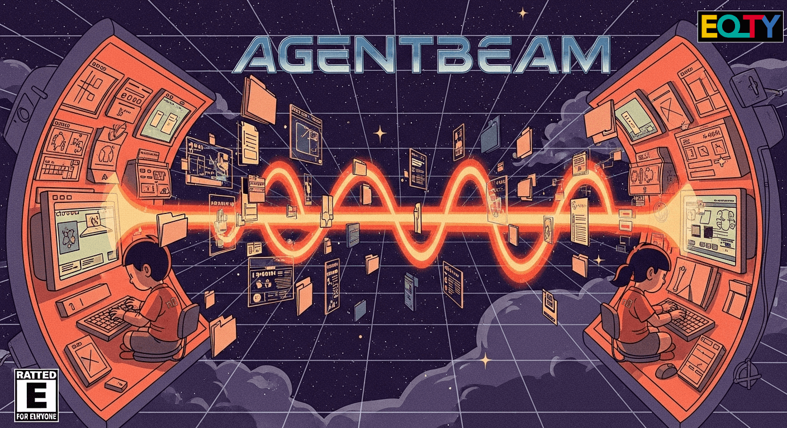

<p align="center">
  <picture>
    
  </picture>
</p>

# AgentBeam

P2P workspace and session sharing for Claude Code developers.

## P2P for Agents (Claude Code initially)

AgentBeam enables direct computer-to-computer transfer of complete Claude Code working states including conversation context, memory files, and exact codebase state. No servers, no accounts, no uploads - just direct P2P transfer using [Iroh](https://github.com/n0-computer/iroh).

```
> charlie beams his current session
... gets a ticket
... shares it with alice

> alice receives charlie's claude session and codebase
... alice can run `claude --continue` to pick up right where charlie left off
```

## Installation

```bash
# Clone and build from source
git clone https://github.com/agentbeam/agentbeam
cd agentbeam
cargo build --release

# Install to PATH
cargo install --path .
```

## Usage

### Sharing a Workspace

```bash
# Share current directory
agentbeam beam-session

# Test mode with dummy data
agentbeam beam-session --test-mode

# Custom workspace path
agentbeam beam-session --workspace /path/to/project

# Direct P2P only (no relay)
agentbeam beam-session --no-relay
```

The command will:

1. Package your workspace (respecting ignore files)
2. Generate a sharing ticket
3. Wait for recipient to connect
4. Show transfer progress
5. Notify when transfer is complete

### Receiving a Workspace

```bash
# Receive to default directory (./beamed-workspace)
agentbeam receive <ticket>

# Specify target directory
agentbeam receive <ticket> --target /path/to/destination

# now you can `claude --continue` in that received codebase.
```

### How P2P Transfer Works

**Default Mode: Direct Connection (Default)**: AgentBeam establishes encrypted peer-to-peer connections directly between your devices using Iroh's QUIC protocol. This provides:

- **True P2P**: Only you and the recipient - no intermediary servers see your data
- **NAT Traversal**: Automatic hole punching through firewalls and routers (~90% success rate)
- **End-to-End Encryption**: Data encrypted specifically for the destination device
- **Optimal Performance**: Direct paths provide lowest latency and highest speeds

<details>
<summary><strong>When Direct P2P Might Not Work</strong></summary>

Direct connections can fail when both devices are behind restrictive NATs or corporate firewalls that block hole punching. In these cases:

- **Corporate Networks**: Some enterprise firewalls block UDP hole punching
- **Symmetric NATs**: Some router configurations prevent direct connection establishment
- **Restricted Networks**: Networks that only allow HTTP/HTTPS traffic
- **Geographic Distance**: Very distant peers may have routing issues

**Solution**: Use relay mode (see below) or connect to the same WiFi network.

</details>

**Relay Fallback**: When direct connections aren't possible, Iroh seamlessly falls back to relay servers that:

- **Coordinate Connections**: Help establish the initial encrypted tunnel
- **Route Encrypted Traffic**: Cannot decrypt your data (end-to-end encrypted)
- **Step Back Automatically**: Once direct connection succeeds, relay stops routing traffic
- **Ensure Reliability**: ~100% connection success rate across any network configuration

**(Potential Roadmap - incomplete)**:

- **Agent Swarms**: Enable multi-agent collaboration and capability sharing
- **Iroh Gossip Protocol**: Multi-agent communication, a better A2A

## Features

- **Direct P2P Transfer**: Share workspaces directly between machines
- **Smart File Filtering**: Respects `.gitignore` and `.beamignore` patterns
- **Memory-Safe Streaming**: Handles large workspaces (5GB+) with minimal RAM usage
- **Provider Monitoring**: Sender knows when transfer is complete
- **Automatic Resume**: Interrupted transfers can be resumed
- **Test Mode**: Safe testing with dummy data

## Ignore Patterns

AgentBeam respects the following ignore patterns in order:

1. `.beamignore` - Custom patterns for beaming
2. `.gitignore` - Standard git ignore patterns
3. Default excludes (node_modules/, target/, .env, etc.)

Example `.beamignore`:

```
*.secret
*.key
credentials.json
large_data/
```

## Architecture

- **Iroh Framework**: P2P networking with QUIC protocol
- **Collections**: Native Iroh format for multi-file transfer
- **FsStore**: Disk-based blob storage (no memory issues)
- **Provider Events**: Real-time transfer monitoring
- **RAII Cleanup**: Automatic temp directory cleanup

## Technical Details

- Max workspace size: 5GB (configurable with `--force`)
- Warning threshold: 1GB
- Protocol: QUIC with optional relay
- Storage: Temporary `.agentbeam-*` directories (auto-cleaned)

## Testing

```bash
# Run tests
cargo test

# Test with dummy data
cargo run -- beam-session --test-mode

# Clean test data
cargo run -- cleanup-test
```

## Development

The codebase is organized as:

- `src/core/` - Core P2P and transfer logic
- `src/cli/` - Command-line interface
- `src/test_utils/` - Testing utilities and dummy data generation

Key components:

- `AgentBeam` - Main struct managing Iroh endpoint and blob storage
- `FileCollector` - Handles workspace file collection and bundling
- `ProviderMonitor` - Tracks upload progress and transfer completion
- `Receiver` - Manages downloads with resume support
